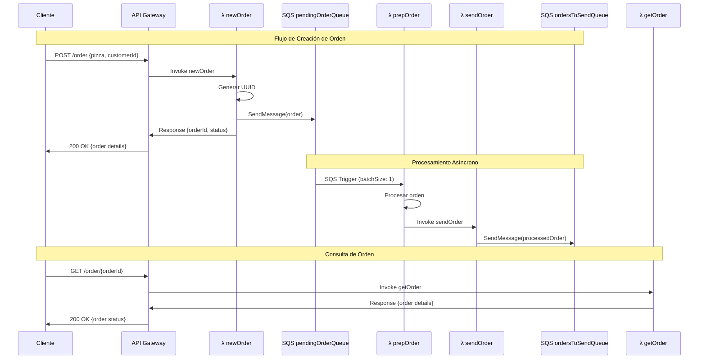
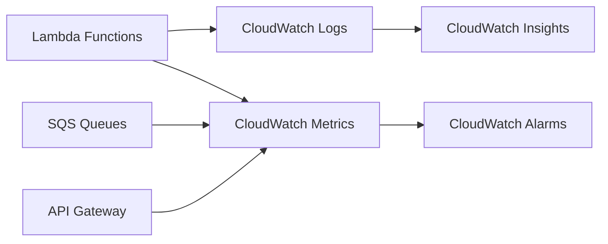

# Diagrama de Arquitectura AWS - Pizza App

## Arquitectura Completa

```mermaid
graph TB
    Client[Cliente/Frontend] --> APIGW[API Gateway]
    
    APIGW --> |POST /order| NewOrder[λ newOrder]
    APIGW --> |GET /order/{id}| GetOrder[λ getOrder]
    
    NewOrder --> |Envía mensaje| PendingQueue[(SQS: pendingOrderQueue)]
    
    PendingQueue --> |Trigger SQS| PrepOrder[λ prepOrder]
    
    PrepOrder --> |Procesa orden| SendOrder[λ sendOrder]
    
    SendOrder --> |Envía mensaje| SendQueue[(SQS: ordersToSendQueue)]
    
    subgraph "AWS Lambda Functions"
        NewOrder
        GetOrder
        PrepOrder
        SendOrder
    end
    
    subgraph "AWS SQS Queues"
        PendingQueue
        SendQueue
    end
    
    subgraph "AWS IAM"
        IAMRole[IAM Role]
        IAMRole --> |sqs:sendMessage| PendingQueue
        IAMRole --> |sqs:sendMessage| SendQueue
    end
    
    NewOrder -.-> IAMRole
    SendOrder -.-> IAMRole
```

## Flujo de Datos Detallado



## Componentes AWS

### 🔧 Lambda Functions

| Función | Runtime | Memoria | Timeout | Trigger |
|---------|---------|---------|---------|---------|
| newOrder | Node.js 20.x | 128MB | 6s | HTTP API |
| getOrder | Node.js 20.x | 128MB | 6s | HTTP API |
| prepOrder | Node.js 20.x | 128MB | 6s | SQS Event |
| sendOrder | Node.js 20.x | 128MB | 6s | Manual/Code |

### 📨 SQS Queues

| Queue | Tipo | Retention | Visibility Timeout |
|-------|------|-----------|-------------------|
| pendingOrderQueue | Standard | 14 días | 30s |
| ordersToSendQueue | Standard | 14 días | 30s |

### 🌐 API Gateway

| Endpoint | Método | Integración | Autenticación |
|----------|--------|-------------|---------------|
| /order | POST | λ newOrder | None |
| /order/{orderId} | GET | λ getOrder | None |

### 🔐 IAM Permissions

```yaml
IAM Role Statements:
- Effect: Allow
  Action: sqs:sendMessage
  Resource: 
    - arn:aws:sqs:us-east-1:*:pendingOrderQueue
    - arn:aws:sqs:us-east-1:*:ordersToSendQueue
```

## Patrones de Arquitectura Implementados

### 1. **Event-Driven Architecture**
- Uso de SQS para desacoplar componentes
- Procesamiento asíncrono de órdenes

### 2. **Microservices Pattern**
- Cada Lambda función tiene una responsabilidad específica
- Comunicación a través de eventos

### 3. **Queue-Based Load Leveling**
- SQS actúa como buffer para manejar picos de carga
- Procesamiento controlado con batchSize

### 4. **Serverless Pattern**
- Sin gestión de infraestructura
- Escalado automático basado en demanda

## Consideraciones de Escalabilidad

- **Lambda Concurrency**: Hasta 1000 ejecuciones concurrentes por defecto
- **SQS Throughput**: Hasta 300 transacciones por segundo
- **API Gateway**: Hasta 10,000 RPS por región

## Monitoreo y Observabilidad



### Métricas Clave:
- **Lambda**: Duration, Errors, Throttles
- **SQS**: Messages Sent, Messages Received, Queue Depth
- **API Gateway**: Count, Latency, 4XX/5XX Errors

## Costos Estimados (us-east-1)

| Servicio | Uso Mensual | Costo Aprox. |
|----------|-------------|--------------|
| Lambda | 1M requests | $0.20 |
| API Gateway | 1M requests | $3.50 |
| SQS | 1M requests | $0.40 |
| **Total** | | **~$4.10/mes** |

*Costos basados en pricing de AWS a fecha actual*