# AWS Architecture Diagram - Pizza App

## Complete Architecture

```mermaid
graph TB
    Client[Client/Frontend] --> APIGW[API Gateway]
    
    APIGW --> |POST /order| NewOrder[λ newOrder]
    APIGW --> |GET /order/{id}| GetOrder[λ getOrder]
    
    NewOrder --> |Send message| PendingQueue[(SQS: pendingOrderQueue)]
    
    PendingQueue --> |SQS Trigger| PrepOrder[λ prepOrder]
    
    PrepOrder --> |Process order| SendOrder[λ sendOrder]
    
    SendOrder --> |Send message| SendQueue[(SQS: ordersToSendQueue)]
    
    subgraph "AWS Lambda Functions"
        NewOrder
        GetOrder
        PrepOrder
        SendOrder
    end
    
    subgraph "AWS SQS Queues"
        PendingQueue
        SendQueue
    end
    
    subgraph "AWS IAM"
        IAMRole[IAM Role]
        IAMRole --> |sqs:sendMessage| PendingQueue
        IAMRole --> |sqs:sendMessage| SendQueue
    end
    
    NewOrder -.-> IAMRole
    SendOrder -.-> IAMRole
```

## Detailed Data Flow

```mermaid
sequenceDiagram
    participant C as Client
    participant AG as API Gateway
    participant NO as λ newOrder
    participant PQ as SQS pendingOrderQueue
    participant PO as λ prepOrder
    participant SO as λ sendOrder
    participant SQ as SQS ordersToSendQueue
    participant GO as λ getOrder
    
    Note over C,SQ: Order Creation Flow
    C->>AG: POST /order {pizza, customerId}
    AG->>NO: Invoke newOrder
    NO->>NO: Generate UUID
    NO->>PQ: SendMessage(order)
    NO->>AG: Response {orderId, status}
    AG->>C: 200 OK {order details}
    
    Note over PQ,SQ: Asynchronous Processing
    PQ->>PO: SQS Trigger (batchSize: 1)
    PO->>PO: Process order
    PO->>SO: Invoke sendOrder
    SO->>SQ: SendMessage(processedOrder)
    
    Note over C,GO: Order Query
    C->>AG: GET /order/{orderId}
    AG->>GO: Invoke getOrder
    GO->>AG: Response {order details}
    AG->>C: 200 OK {order status}
```



## AWS Components

### 🔧 Lambda Functions

| Function | Runtime | Memory | Timeout | Trigger |
|----------|---------|---------|---------|---------|
| newOrder | Node.js 20.x | 128MB | 6s | HTTP API |
| getOrder | Node.js 20.x | 128MB | 6s | HTTP API |
| prepOrder | Node.js 20.x | 128MB | 6s | SQS Event |
| sendOrder | Node.js 20.x | 128MB | 6s | Manual/Code |

### 📨 SQS Queues

| Queue | Type | Retention | Visibility Timeout |
|-------|------|-----------|-------------------|
| pendingOrderQueue | Standard | 14 days | 30s |
| ordersToSendQueue | Standard | 14 days | 30s |

### 🌐 API Gateway

| Endpoint | Method | Integration | Authentication |
|----------|--------|-------------|---------------|
| /order | POST | λ newOrder | None |
| /order/{orderId} | GET | λ getOrder | None |

### 🔐 IAM Permissions

```yaml
IAM Role Statements:
- Effect: Allow
  Action: sqs:sendMessage
  Resource: 
    - arn:aws:sqs:us-east-1:*:pendingOrderQueue
    - arn:aws:sqs:us-east-1:*:ordersToSendQueue
```

## Implemented Architecture Patterns

### 1. **Event-Driven Architecture**
- Use of SQS to decouple components
- Asynchronous order processing

### 2. **Microservices Pattern**
- Each Lambda function has a specific responsibility
- Communication through events

### 3. **Queue-Based Load Leveling**
- SQS acts as buffer to handle load spikes
- Controlled processing with batchSize

### 4. **Serverless Pattern**
- No infrastructure management
- Automatic scaling based on demand

## Scalability Considerations

- **Lambda Concurrency**: Up to 1000 concurrent executions by default
- **SQS Throughput**: Up to 300 transactions per second
- **API Gateway**: Up to 10,000 RPS per region

## Monitoring and Observability


### Key Metrics:
- **Lambda**: Duration, Errors, Throttles
- **SQS**: Messages Sent, Messages Received, Queue Depth
- **API Gateway**: Count, Latency, 4XX/5XX Errors

## Estimated Costs (us-east-1)

| Service | Monthly Usage | Approx. Cost |
|---------|---------------|--------------|
| Lambda | 1M requests | $0.20 |
| API Gateway | 1M requests | $3.50 |
| SQS | 1M requests | $0.40 |
| **Total** | | **~$4.10/month** |

*Costs based on current AWS pricing*